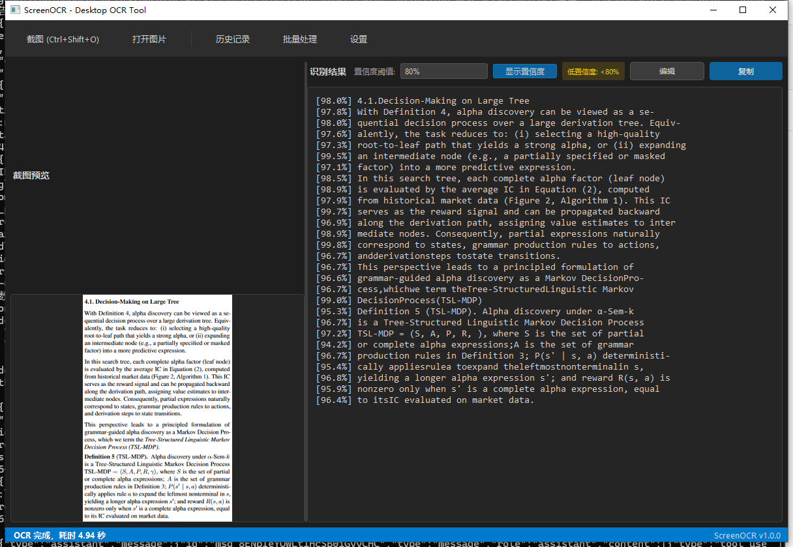
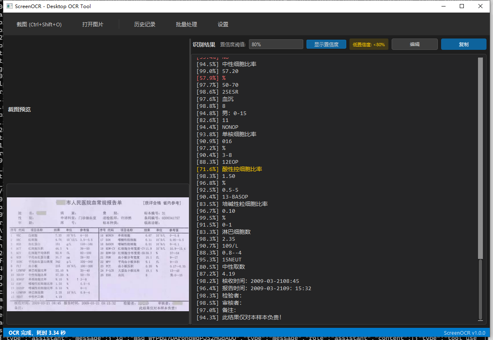

# ScreenOCR

基于 PaddleOCR 的桌面 OCR 工具，支持截图识别、批量处理、置信度显示等功能。

## 功能特性

- **截图识别**: 全局快捷键 `Ctrl+Shift+O` 快速截图并识别文字
- **批量处理**: 支持多图片批量 OCR 识别
- **置信度显示**: 显示每行文字的识别置信度，低置信度文字高亮标注
- **历史记录**: 自动保存识别历史，支持搜索和恢复
- **编辑模式**: 支持对识别结果进行编辑和保存
- **深色主题**: 现代化的 VS Code 风格深色界面

## 截图预览

### 主界面


### 快捷键设置


## 快捷键

| 快捷键 | 功能 |
|--------|------|
| Ctrl+Shift+O | 截图识别 |
| Ctrl+C | 复制结果 |
| Ctrl+S | 保存结果 |
| Ctrl+E | 编辑模式 |

## 安装使用

### 方式一：便携版（推荐）

1. 从 [Releases](https://github.com/4111y80y/paddleocr/releases) 下载最新版本
2. 解压后运行 `ScreenOCR.bat`

> 注意：便携版需要下载附带的 Python 环境包（约 1.6GB），解压到 `portable/python/` 目录

### 方式二：从源码运行

```bash
# 克隆仓库
git clone https://github.com/4111y80y/paddleocr.git
cd paddleocr

# 创建虚拟环境
python -m venv venv
venv\Scripts\activate

# 安装依赖
pip install -r requirements_exact.txt

# 运行
python src/main.py
```

## 依赖

- Python 3.10+
- PySide6
- PaddleOCR
- paddlepaddle

## 项目结构

```
paddleocr/
├── src/                    # 源代码
│   ├── main.py            # 程序入口
│   ├── main_window.py     # 主窗口
│   ├── ocr_engine.py      # OCR 引擎封装
│   ├── screenshot_overlay.py  # 截图覆盖层
│   ├── settings.py        # 设置管理
│   ├── history_manager.py # 历史记录管理
│   └── hotkey_settings_dialog.py  # 快捷键设置对话框
├── portable/              # 便携版
│   ├── src/              # 源代码副本
│   ├── python/           # 内嵌 Python 环境（需单独下载）
│   └── ScreenOCR.bat     # 启动脚本
├── demo/                  # 演示图片
└── requirements_exact.txt # 依赖列表
```

## 技术实现

- **GUI**: PySide6 (Qt6)
- **OCR**: PaddleOCR (中英文识别)
- **异步处理**: QTimer 替代 QThread，避免程序退出时崩溃
- **持久化**: JSON 配置文件 + SQLite 历史记录

## License

MIT License
